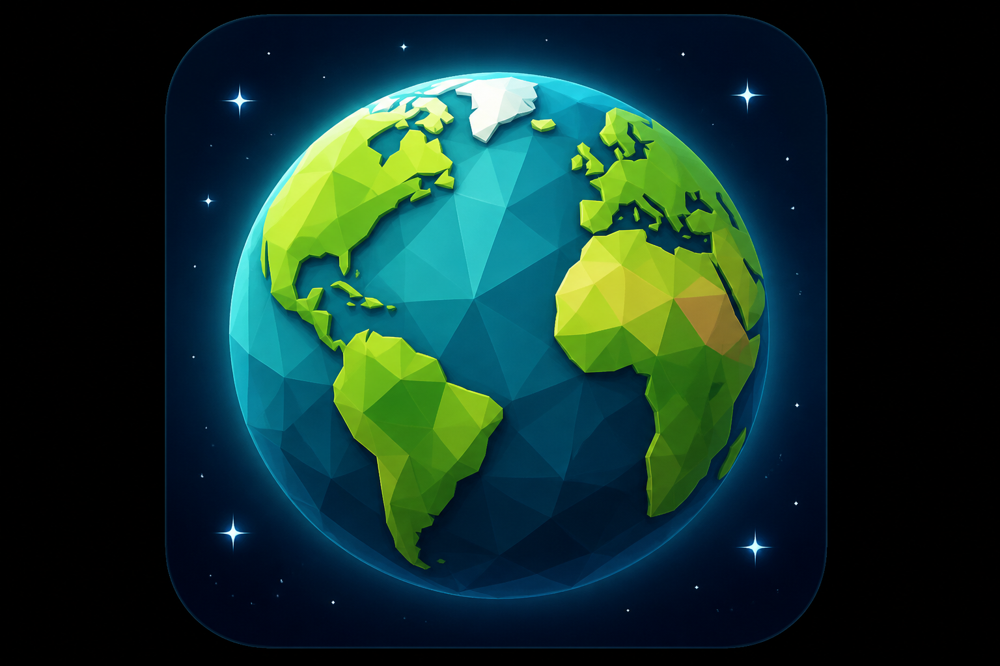

# GeoWorld

<p align="center">
  
</p>

[](LICENSE)

Unity **6** project (**6000.4.5f1**). A third-person style **survival / horde** prototype built around a **GeoMancer** player: manage health, mana, and XP on a timer while enemies scale with your level.

## What the game is

- **Core loop**: Stay alive, kill waves of enemies, level up (up to **50** in current player logic), and survive until the round timer expires—or lose if health hits zero.
- **Round rules** (`GameOver`): **15-minute** countdown (`900` seconds), kill counters for normal and **greater** enemies, game over on death or time up.
- **Fantasy hook**: Earth / “geo” themed skills (projectiles, blast, meteor, time freeze, blood ritual, heal, etc.) against spawned enemies including stronger variants and periodic **boss** spawns tied to level milestones (`EnemyGenerator`).

Main scenes (under `Assets/_SCENES/`):

- **`Start.unity`** — Press **G** to load the main scene (`GameStart`).
- **`GeoWorldMain.unity`** — Primary gameplay scene.

## Gameplay systems (high level)

| Area | Role |
|------|------|
| **`PlayerCharacter`** | Level, XP curve, mana, health regen, leveling scales enemy stats via **`EnemyGenerator`**. |
| **`EnemyGenerator`** | State machine (`Initialize` → `Setup` → `SpawnEnemy`): maintains a **target list**, spawns to match `level * 40` enemies, optional **greater** enemies from level **10+**, **boss** on levels divisible by **5** when greater spawns are enabled. |
| **`SkillBasic` + skills** | Shared mana/cooldown helpers; skills find player by tag **`Player1`**, read **`GameOver`** flags to block input when dead or time over. |
| **`UserInterface`** | Legacy **`OnGUI`** HUD: bars, skill icons, crosshair, blood splats. |
| **`GameOver`** | Timer, kill UI (**Unity UI `Text`**), end screens, **`Application.Quit`** on Escape when dead. |

Enemy behaviour lives under `Assets/_SCRIPTS/Behaviour/` (`EnemyAI`, `GreaterEnemyAI`, `HomingMissileAI`, etc.).

## Repository layout

```
Assets/
  _SCRIPTS/          # Your game code (characters, skills, GUI, AI)
  _SCENES/           # GameStart + GeoWorldMain (+ .meta)
  _ASSETS/, _PREFABS/, _TERRAIN/, etc.
  Standard Assets/   # Legacy Unity Standard Assets (effects, water, input, vehicles…)
Packages/
  manifest.json      # Includes com.unity.ugui; mostly built-in modules
ProjectSettings/
```

**Design note**: The project mixes **old Standard Assets** (Unity 5 era) with **Unity 6**; much of the maintenance work is updating obsolete APIs in those packages and keeping the custom `_SCRIPTS` compiling.

## Development patterns (as implemented)

These reflect how the game was built historically—not necessarily current Unity “best practice”:

1. **MonoBehaviour-centric**  
   No formal service layer; systems are components on GameObjects, wired in the Inspector or found at runtime.

2. **Discovery by tag and `GetComponent`**  
   Widespread use of `GameObject.FindGameObjectWithTag("Player1")` and chained `GetComponent<T>()` from skills and UI.

3. **Dual UI stack**  
   - HUD and overlays: **`OnGUI`** (`UserInterface`, parts of `GameOver`).  
   - Some screens/widgets: **`UnityEngine.UI`** (`Text` on `GameOver`).

4. **Inheritance for skills**  
   `SkillBasic` base class (mana, cooldown, reference to player); concrete skills (`GeoShot`, `Meteor`, …) override behaviour in `Update` and input.

5. **Explicit state machine for spawning**  
   `EnemyGenerator` uses an enum `State` and a `switch` in `Update` rather than coroutines or async.

6. **Balancing and TODOs in-repo**  
   See `Assets/TO-DO.txt` (German): boss tuning, damage floaters, lifesteal edge cases, meteor VFX vs level, etc.

## Requirements

- **Unity Hub** + Editor **6000.4.5f1** (or compatible **Unity 6.4** line; project version is in `ProjectSettings/ProjectVersion.txt`).
- Open the project folder that contains **`Assets`**, **`Packages`**, and **`ProjectSettings`** (repository root).

## Build output

Do **not** set the build output to the project root. Use a subfolder, e.g. `Builds/Windows` or `Builds/WebGL`.

## Contributing / picking it back up

1. Open **`GeoWorldMain`** from `Assets/_SCENES` (or run from **`Start`** and press **G**).  
2. Prefer fixing gameplay in **`Assets/_SCRIPTS`**; treat **`Standard Assets`** as legacy third-party code unless you plan a full replacement.  
3. After big Unity upgrades, expect more obsolete API warnings in **Standard Assets**; the custom game scripts are the source of truth for design intent.

## License

Your original project code in this repository is licensed under the **MIT License** — see [`LICENSE`](LICENSE).

**Third-party content** (for example **Unity Standard Assets** and Asset Store / pack assets under `Assets/`) may be governed by **other** licenses from Unity Technologies or those publishers. The MIT license applies to what you own and contribute here, not necessarily to every file in `Assets/`.

---

*README generated from the current codebase structure and scripts; adjust wording if you rename scenes, tags, or core balance numbers.*
